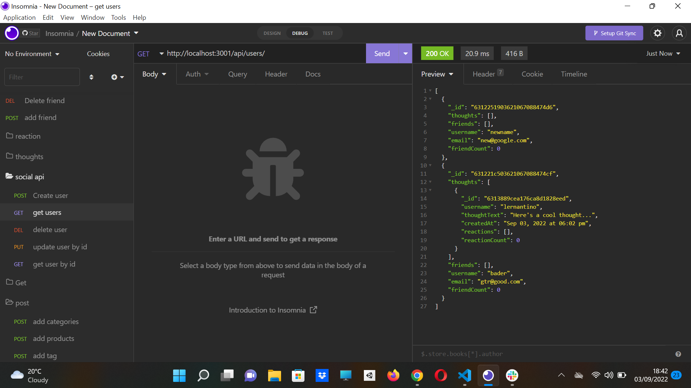

# social-networking-api

## Description:

a social-networking api that you can create thoughts and perform crud operations. a user can have reaction on thoughts and become friends with that user. you can perform crud operations on the user aswell.

# Table of Contents

- [Walkthrough](#walkthrough)
- [Installation](#installation)
- [Usage](#usage)
- [Credits](#credits)
- [License](#license)
- [Contribution](#contributing)
- [Screenshot](#screenshot)
- [Contact](#contacts)

## Installation:

- run `npm install` in terminal to install the dependencies.
- type `node server.js` in the console to run the application server.
- use insomina to check crud routes

## Walkthrough

[WalkThrough Part1](https://watch.screencastify.com/v/uihVY7cRGf5wkL8omJY6)
[walkthrough part2](https://watch.screencastify.com/v/sbxwg5GcXpOzZlgTg4uS)

## Technologies

- JavaScript
- Nodejs

## Usage:

this will perform crud operation on user thoughts

## Credits:

Made by Bader Munir

## License:

For more information about licenses, please visit:

[License](https://opensource.org/licenses/MIT)

## Contributing:

It is open source

## Screenshot:

## Contact:

- [Github Profile](https://github.com/XBaderM)

- [Email](bader.munir18@googlemail.com)
